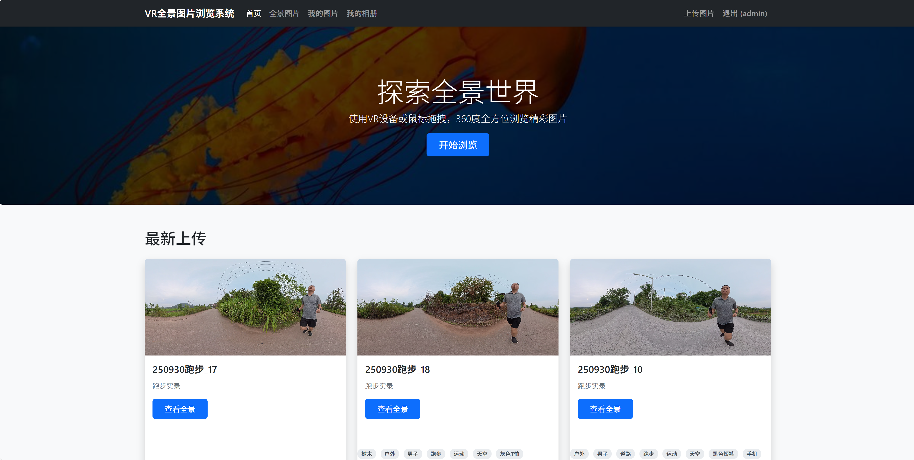

# VR全景图片浏览系统 📷👁️‍🗨️

[](https://github.com/top-think/think/blob/8.0/LICENSE.txt)
[](https://github.com/top-think/think)
[](https://aframe.io/)

一个基于Web的360度全景图片展示和管理系统，支持用户上传、管理、浏览和分享VR全景图片，带来沉浸式视觉体验。

<p align="center">
  
</p>

## 🌟 特色功能

### 📹 360°全景浏览
- 基于WebGL的高质量全景图片展示
- 支持鼠标拖拽和触摸滑动操作
- VR设备兼容，提供沉浸式体验

### 🔗 热点导航系统
- 在全景图片间创建跳转链接
- 实现虚拟漫游体验
- 打造交互式全景展示

### 📱 响应式设计
- 完美适配桌面端和移动端设备
- 简洁直观的操作界面
- 流畅的用户体验

### 🤖 AI智能标签
- 自动为上传图片生成描述性标签
- 基于阿里云DashScope AI服务
- 提升图片管理效率

## 🚀 快速开始

### 系统要求
- PHP 8.0+
- MySQL 5.7+ 或 MariaDB 10.2+
- Composer 2.0+
- GD或Imagick PHP扩展

### 安装步骤

1. 克隆项目代码
```bash
git clone https://github.com/78778443/vr-photos.git
cd vr-photos/web
```

2. 安装依赖
```bash
composer install
```

3. 配置数据库
```sql
CREATE DATABASE `360photos` DEFAULT CHARACTER SET utf8mb4 COLLATE utf8mb4_unicode_ci;
```

4. 导入数据库结构
```bash
mysql -u username -p 360photos < database.sql
```

5. 配置环境变量
```bash
cp .example.env .env
```

编辑`.env`文件配置数据库连接信息：
```env
DB_TYPE = mysql
DB_HOST = 127.0.0.1
DB_NAME = 360photos
DB_USER = your_database_username
DB_PASS = your_database_password
DB_PORT = 3306
```

6. 设置目录权限
```bash
chmod -R 755 runtime/
chmod -R 755 public/uploads/
chmod -R 755 public/thumbnails/
```

7. 启动开发服务器
```bash
php think run
```

访问 `http://localhost:8000` 开始使用系统！

## 🛠️ 核心功能模块

### 用户管理系统
- 用户注册和登录
- 个人资料管理
- 权限控制（公开/私有图片）

### 图片管理系统
- 全景图片上传（JPG、PNG格式）
- 批量上传功能
- 图片标签和分类管理
- 缩略图自动生成

### 相册系统
- 个人相册创建和管理
- 相册封面设置
- 图片归类到相册

### 分享功能
- 生成分享链接
- 嵌入代码生成
- 社交媒体分享支持

## 🏗️ 技术架构

### 前端技术栈
- **框架**: Bootstrap 5
- **VR引擎**: A-Frame 1.4.0
- **交互库**: jQuery 3.6.0
- **响应式设计**: 移动优先的响应式布局

### 后端技术栈
- **框架**: ThinkPHP 8.0
- **数据库**: MySQL/SQLite
- **模板引擎**: 原生PHP模板
- **文件存储**: 本地文件系统

## 📚 文档资源

- [安装说明](docs/INSTALL.md) - 详细的系统安装和配置指南
- [用户手册](docs/user_manual.md) - 完整的系统使用说明

## 🤝 贡献指南

欢迎提交Issue和Pull Request来改进系统：

1. Fork项目
2. 创建功能分支 (`git checkout -b feature/AmazingFeature`)
3. 提交更改 (`git commit -m 'Add some AmazingFeature'`)
4. 推送到分支 (`git push origin feature/AmazingFeature`)
5. 开启Pull Request

## 📄 许可证

本项目基于Apache 2.0许可证发布，详见 [LICENSE](LICENSE.txt) 文件。

## 🙏 致谢

- [ThinkPHP](https://github.com/top-think/think) - 现代化的PHP开发框架
- [A-Frame](https://aframe.io/) - WebVR框架
- [Bootstrap](https://getbootstrap.com/) - 响应式前端框架
- [jQuery](https://jquery.com/) - JavaScript库